# Probabilistic AutoEncoder

The core of `SuPAErnova` is a probabilistic autoencoder trained to encode a SN Ia spectrum into a set of latent parameters, and decode a set of latent parameters into a SN Ia spectrum.

## Encoder Design

### Dense Encoder

```mermaid
graph LR
    subgraph INPUTS["Inputs"]
        IN_AMP[["
            ``Amplitude''<br>
            Input::Float32
            [batch_dim,&nbsp;phase_dim,&nbsp;wl_dim]
        "]]
        IN_PHASE[["
            ``Phase''<br>
            Input::Float32
            [batch_dim, phase_dim, 1]
        "]]
        IN_MASK[["
            ``Mask''<br>
            Input::Int32
            [batch_dim,&nbsp;phase_dim,&nbsp;wl_dim]
        "]]
    end


    CONCAT1("
        Concatenate::Float32
        [batch_dim,&nbsp;phase_dim,&nbsp;wl_dim&nbsp;+&nbsp;1]
    ")

    IN_AMP & IN_PHASE-->CONCAT1

    subgraph FOR_ENCODE["for&nbsp;n&nbsp;in&nbsp;*encode_dims*"]
        DENSEI("
            Dense::Float32
            [batch_dim, phase_dim, n]
            <hr>**Args**
            activation = *activation*
            kernel_regularizer&nbsp;=&nbsp;*kernel_regulariser*
        ")

        DROPOUT("
            Dropout::Float32
            [batch_dim, phase_dim, n]
            <hr>**Args**
            rate = *dropout*
            noise_shape&nbsp;=&nbsp;[None,&nbsp;1,&nbsp;None]
        ")
        BATCHNORM("
            BatchNormalization::Float32
            [batch_dim, phase_dim, n]
        ")

        DENSEI-..->|if *dropout* > 0|DROPOUT
        DENSEI-..->|if *batchnorm*|BATCHNORM
        DENSEI-..->|otherwise|BLANK0[" "]

        BLANK0 & DROPOUT & BATCHNORM==>DENSEI
    end

    CONCAT1-->DENSEI

    DENSE_SPEC("
        Dense::Float32
        [batch_dim, phase_dim, phase_dim]
        <hr>**Args**
        activation = *activation*
        kernel_regularizer&nbsp;=&nbsp;*kernel_regulariser*
    ")

    BLANK0 & DROPOUT & BATCHNORM-->BLANKFOR[" "]-->|endfor|DENSE_SPEC

    DENSE_LATENT("
        DENSE::Float32
        [batch_dim,&nbsp;phase_dim,&nbsp;n_physical&nbsp;+&nbsp;n_latent]
        <hr>**Args**
        kernel_regularizer&nbsp;=&nbsp;*kernel_regulariser*
        use_bias = False
    ")

    DENSE_SPEC-->DENSE_LATENT

    IS_KEPT("
        ReduceMin::Int32
        [batch_dim, phase_dim, 1]
        <hr>**Args**
        axis = -1
        keepdims = True
    ")

    IN_MASK-->IS_KEPT

    MULTIPLY1("
        Multiply::Float32
        [batch_dim,&nbsp;phase_dim,&nbsp;n_physical&nbsp;+&nbsp;n_latent]
    ")

    SUM1("
        ReduceSum::Int32
        [batch_dim, 1]
        <hr>**Args**
        axis = -2
    ")

    DENSE_LATENT & IS_KEPT-->MULTIPLY1

    IS_KEPT-->SUM1

    SUM2("
        ReduceSum::Float32
        [batch_dim,&nbsp;n_physical&nbsp;+&nbsp;n_latent]
        <hr>**Args**
        axis = -2
    ")

    MAXIMUM1("
        Maximum::Int32
        [batch_dim, 1]
        <hr>**Args**
        y = 1
    ")

    MULTIPLY1-->SUM2

    SUM1-->MAXIMUM1

    DIVIDE1("
        Divide::Float32
        [batch_dim,&nbsp;n_physical&nbsp;+&nbsp;n_latent]
    ")

    SUM2 & MAXIMUM1-->DIVIDE1

    IS_KEPT_SLICE("
        GetItem::Float32
        [batch_dim, phase_dim]
        <hr>**Args**
        [..., 0]
    ")

    OUTPUT[["
        ``Outputs''<br>
        Output::Float32
        [batch_dim,&nbsp;n_physical&nbsp;+&nbsp;n_latent]
    "]]
    
    subgraph STAGES["Stages"]
        DAV("
            ``DeltaAv''<br>
            GetItem::Float32
            [batch_dim, 1]
            <hr>**Args**
            [..., 2:3]
        ")
        IS_KEPT_AV("
            Multiply::Float32
            [batch_dim, batch_dim]
        ")
        SUM_AV("
            ReduceSum::Float32
            [batch_dim,]
            <hr>**Args**
            axis = 0
        ")
        DIV_AV("
            Divide
            [batch_dim,]
        ")
        SUBTRACT_AV("
            Subtract::Float32
            [batch_dim, 1]
        ")

        LATENTS("
            ``Latents''<br>
            GetItem::Float32
            [batch_dim, n_latent]
            <hr>**Args**
            [..., 3:]
        ")
        MULTIPLY_LATENTS_N("
            Multiply::Float32
            [batch_dim, n_latent]
            <hr>**Args**
            y = n_latent[stage:] * 0
        ")

        DAMP("
            ``DeltaAmp''<br>
            GetItem::Float32
            [batch_dim, 1]
            <hr>**Args**
            [..., 1:2]
        ")
        MULTIPLY_AMP_0("
            Multiply::Float32
            [batch_dim, 1]
            <hr>**Args**
            y = 0
        ")
        IS_KEPT_AMP("
            Multiply::Float32
            [batch_dim, batch_dim]
        ")
        SUM_AMP("
            ReduceSum::Float32
            [batch_dim,]
            <hr>**Args**
            axis = 0
        ")
        DIV_AMP("
            Divide
            [batch_dim,]
        ")
        SUBTRACT_AMP("
            Subtract::Float32
            [batch_dim, 1]
        ")


        DPHASE("
            ``DeltaPhase''<br>
            GetItem::Float32
            [batch_dim, 1]
            <hr>**Args**
            [..., 0:1]
        ")

        MULTIPLY_PHASE_0("
            Multiply::Float32
            [batch_dim, 1]
            <hr>**Args**
            y = 0
        ")
        IS_KEPT_PHASE("
            Multiply::Float32
            [batch_dim, batch_dim]
        ")
        SUM_PHASE("
            ReduceSum::Float32
            [batch_dim,]
            <hr>**Args**
            axis = 0
        ")
        DIV_PHASE("
            Divide
            [batch_dim,]
        ")
        SUBTRACT_PHASE("
            Subtract::Float32
            [batch_dim, 1]
        ")


        CONCAT2("
            Concatenate::Float32
            [batch_dim,&nbsp;n_physical&nbsp;+&nbsp;n_latent]
        ")

        SUBTRACT_PHASE & SUBTRACT_AMP & SUBTRACT_AV-->CONCAT2

        BLANKEND[" "]
    end

    IS_KEPT-->IS_KEPT_SLICE

    IS_KEPT_NORM("
        ReduceMax::Float32
        [batch_dim,]
        <hr>**Args**
        axis = -1
    ")

    IS_KEPT_SLICE---->IS_KEPT_NORM

    REDUCED_IS_KEPT_NORM("
        ReduceSum::Float32
        []
    ")

    IS_KEPT_NORM-->REDUCED_IS_KEPT_NORM

    DAV----->|Stage 0 onwards|IS_KEPT_AV
    IS_KEPT_NORM-->IS_KEPT_AV
    REDUCED_IS_KEPT_NORM-->DIV_AV
    IS_KEPT_AV-->SUM_AV--->DIV_AV
    DIV_AV & DAV-->SUBTRACT_AV

    LATENTS--->|Stage 0 to n_latent|MULTIPLY_LATENTS_N-------->CONCAT2
    LATENTS-->|Stage n_latent onwards|CONCAT2
    
    DAMP--->|Stage 0 to n_latent|MULTIPLY_AMP_0--->IS_KEPT_AMP
    DAMP-->|Stage n_latent + 1 onwards|IS_KEPT_AMP
    IS_KEPT_NORM-->IS_KEPT_AMP
    REDUCED_IS_KEPT_NORM-->DIV_AMP
    IS_KEPT_AMP-->SUM_AMP--->DIV_AMP
    DIV_AMP & DAMP-->SUBTRACT_AMP

    DPHASE--->|Stage 0 to&nbsp;n_latent&nbsp;+&nbsp;1|MULTIPLY_PHASE_0--->IS_KEPT_PHASE
    DPHASE-->|Stage n_latent + 2|IS_KEPT_PHASE
    IS_KEPT_NORM-->IS_KEPT_PHASE
    REDUCED_IS_KEPT_NORM-->DIV_PHASE
    IS_KEPT_PHASE-->SUM_PHASE--->DIV_PHASE
    DIV_PHASE & DPHASE-->SUBTRACT_PHASE

    DIVIDE1-..->|if *physical_latents*|BLANK1[" "]
    DIVIDE1-..->|otherwise|BLANKSTART
    BLANK1[" "]-->DAV
    BLANK1[" "]-->LATENTS
    BLANK1[" "]-->DAMP
    BLANK1[" "]-->DPHASE

    CONCAT2-->OUTPUT
    BLANKSTART[" "]----------->BLANKEND-->OUTPUT
```

